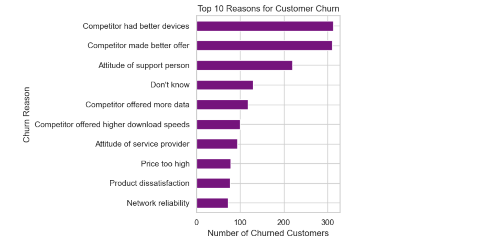

# Customer Churn Analysis

## Project Overview

This project analyzes 7,043 telecommunications customers to identify customer characteristics, service patterns, and financial factors associated with churn. The original data was provided in five Excel files, converted into UTF-8 CSV files, imported into MySQL, validated, combined using SQL joins, and analyzed using SQL and Python.

## Project Objective

The objective is to understand which customer groups are more likely to leave and provide practical recommendations that could help the company improve customer retention.

## Tools Used

- MySQL Workbench
- SQL
- Python
- pandas
- Matplotlib
- SQLAlchemy
- Jupyter Notebook

## Dataset

The project uses five related Excel source files. UTF-8 CSV copies were created in the processed folder for MySQL import:

- **Demographics:** Customer age, gender, marital status, dependents, and senior-citizen information.
- **Location:** Customer location details, including city, ZIP code, latitude, and longitude.
- **Population:** Population information for each ZIP code.
- **Services:** Contract type, internet service, payment method, tenure, monthly charges, and total revenue.
- **Status:** Customer status, churn label, churn score, churn category, and churn reason.

The customer-level tables contain **7,043 customers**, while the population table contains **1,671 ZIP-code records**.

## Project Structure

```text
Customer Churn Analysis/
├── data/
│   ├── raw/
│   └── processed/
├── images/
│   └── top_churn_reasons.png
├── notebooks/
│   └── customer_churn_analysis.ipynb
├── outputs/
│   └── customer_churn_analysis.html
├── sql/
│   ├── 01_create_database.sql
│   ├── 02_create_tables.sql
│   ├── 03_validate_imports.sql
│   ├── 04_load_location.sql
│   ├── 05_load_population.sql
│   ├── 06_load_services.sql
│   ├── 07_load_status.sql
│   ├── 08_exploratory_analysis.sql
│   └── 09_create_analysis_view.sql
├── .gitignore
├── README.md
└── requirements.txt
```

## Analysis Workflow

1. Inspected the five Excel source files and converted them into UTF-8 CSV files for database import.
2. Created relational tables in MySQL for demographics, location, population, services, and customer status.
3. Used staging tables to prepare imported data and convert columns into appropriate data types.
4. Validated row counts, duplicate customer IDs, missing records, and relationships between tables.
5. Joined the tables into a master SQL view containing 7,043 customers and 51 columns.
6. Performed exploratory analysis using SQL.
7. Loaded the master view into Python and created visualizations using pandas and Matplotlib.

## Key Findings

- The overall customer churn rate was **26.54%**, representing 1,869 of 7,043 customers.
- Month-to-month customers had the highest contract-based churn rate at **45.84%**.
- Customers in their first 0–6 months had the highest tenure-based churn rate at **53.33%**.
- Fiber Optic customers had the highest internet-service churn rate at **40.72%**.
- Churned customers paid an average monthly charge of **USD 74.44**, compared with **USD 61.27** for customers who did not churn.
- Competitor-related issues were the largest churn category, accounting for **841 churned customers**.

## Visualization



*Competitor-related issues were the most frequently reported reasons for customer churn.*

## Business Recommendations

1. Improve onboarding and customer support during the first six months, when customers are most likely to leave.
2. Encourage month-to-month customers to choose longer contracts through discounts, loyalty rewards, or additional benefits.
3. Review Fiber Optic pricing, reliability, speed, and customer-support experience.
4. Compare the company’s devices and promotional offers with competitors.
5. Proactively contact customers with high monthly charges to ensure they are receiving enough value from their plans.

## Project Files

- [View the Jupyter Notebook](notebooks/customer_churn_analysis.ipynb)
- [Download the exported HTML report](outputs/customer_churn_analysis.html)
- [View the exploratory SQL analysis](sql/08_exploratory_analysis.sql)
- [View all SQL scripts](sql/)